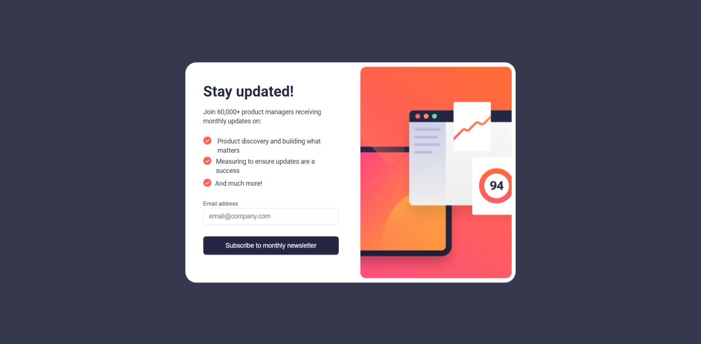
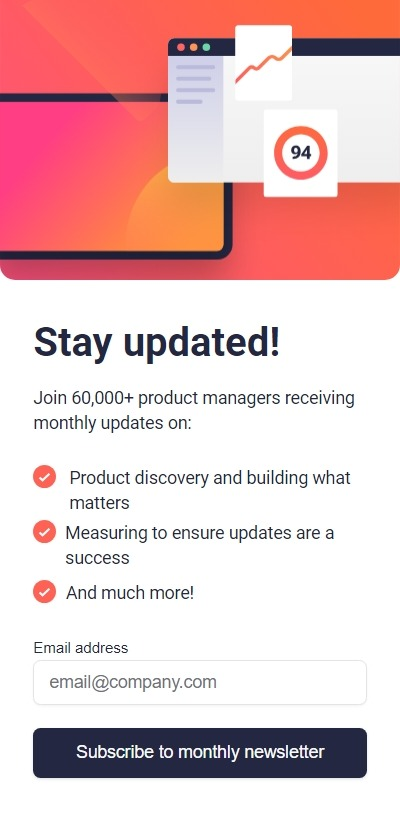
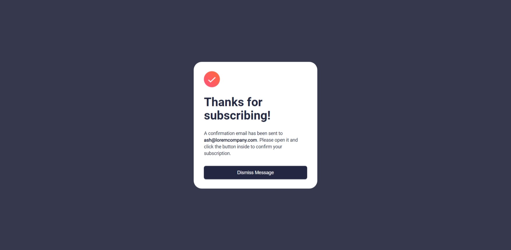
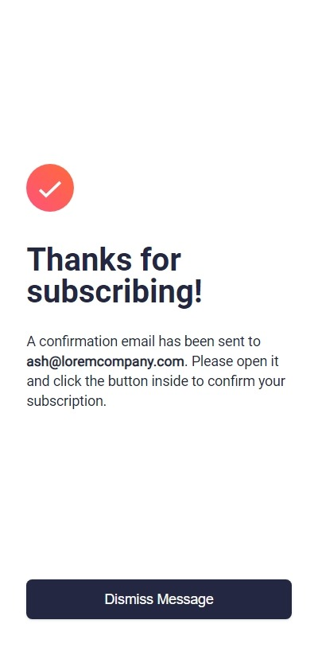

# Newsletter-sign-up-page using Tailwind, shadcn/ui, and Next.JS

## Functionalities

The users should be able to:

- Enter their their email address and submit the form.
- See a success message with their email after successfully submitting the form.
- See form validation messages if:
  - The field is left empty.
  - The email address is not formatted correctly.
- View the optimal layout for the interface depending on their device's screen size.
- See hover and focus states for all interactive elements on the page.

### Screenshot

### Links

- Solution URL: [Add solution URL here](https://github.com/konraddissake1808/newsletter-sign-up-page)

- Live Site URL: [Add live site URL here](https://newsletter-sign-up-page-zeta.vercel.app/signUpPage)

### Built with

- Semantic HTML5 markup
- CSS custom properties
- Flexbox
- CSS Grid
- Mobile-first workflow
- [React](https://reactjs.org/) - JS library
- [Next.js](https://nextjs.org/) - React framework
- [TailwindCSS](https://tailwindcss.com/) - CSS framework
- [ShadCN/ui](https://ui.shadcn.com/) - Component library